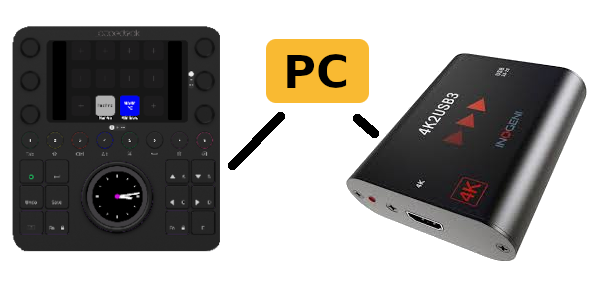

# InogeniLoupdeckControlPlugin

InogeniLoupdeckControlPlugin is a Loupedeck plugin for controlling an
[INOGENI TOGGLE USB 3.0 switcher](https://inogeni.com/product/toggle/) from a
[Loupedeck CT](https://loupedeck.com/us/products/loupedeck-ct/).

The plugin adds Loupedeck actions for switching the INOGENI TOGGLE between its two USB
host ports. It communicates with the TOGGLE over its RS-232 control interface and keeps
the Loupedeck button state in sync by querying the currently selected host.

Typical use case: a meeting room where shared USB peripherals, such as cameras,
speakerphones or microphones, need to be switched between a room PC and a second host
computer directly from the Loupedeck surface.



## Hardware

- [INOGENI TOGGLE](https://inogeni.com/product/toggle/): USB 3.0 switcher with RS-232
  control support.
- [Loupedeck CT](https://loupedeck.com/us/products/loupedeck-ct/): customizable control
  surface used to expose the plugin actions as buttons.

## Build

### Standard build

From the repository root:

```console
cmake -S . -B build
cmake --build build
```

This is the normal build path. It builds both parts of the project:

- `serial_service`, the C based serial bridge
- `InogeniLoupdeckControlPlugin.sln`, the Loupedeck plugin built with .NET

CMake builds the serial bridge first and then passes the generated bridge binary path into
MSBuild via `SerialBridgePath`, so the plugin post-build step copies the correct binary into
the plugin output folder.

### Requirements

- .NET 8 SDK
- CMake and a C compiler
- Logi/Loupedeck Plugin Service installed, so `PluginApi.dll` and `SkiaSharp.dll` are available

On macOS the project file expects the Logi Plugin Service libraries at the default location:

```console
/Applications/Utilities/LogiPluginService.app/Contents/MonoBundle/
```

### Output

The Debug plugin output is written to:

```console
bin/Debug/mac
```

The project also writes a plugin link file into the Logi Plugin Service plugin directory as
part of the post-build step.

### Custom PluginApi path

If `PluginApi.dll` is not in the default macOS location, pass the Logi Plugin Service
`MonoBundle` directory to CMake:

```console
cmake -S . -B build -DPLUGIN_API_DIR=/path/to/LogiPluginService/MonoBundle/
cmake --build build
```

### Build the serial bridge only

From the repository root:

```console
cmake -S SerialBridgeDotNet/src -B SerialBridgeDotNet/src/build
cmake --build SerialBridgeDotNet/src/build
```

### Build the Loupedeck plugin only

From the repository root, change into the .NET solution directory:

```console
cd src
dotnet build InogeniLoupdeckControlPlugin.sln
```

If `PluginApi.dll` is not in the default macOS location, provide the Logi Plugin Service
`MonoBundle` path explicitly:

```console
cd src
dotnet build InogeniLoupdeckControlPlugin.sln \
  -p:PluginApiDir=/path/to/LogiPluginService/MonoBundle/ \
  -p:SerialBridgePath=/path/to/serial_service
```

### Run the serial bridge manually

```console
./serial_service -d /dev/tty.usbserial-123 -b 9600
```
